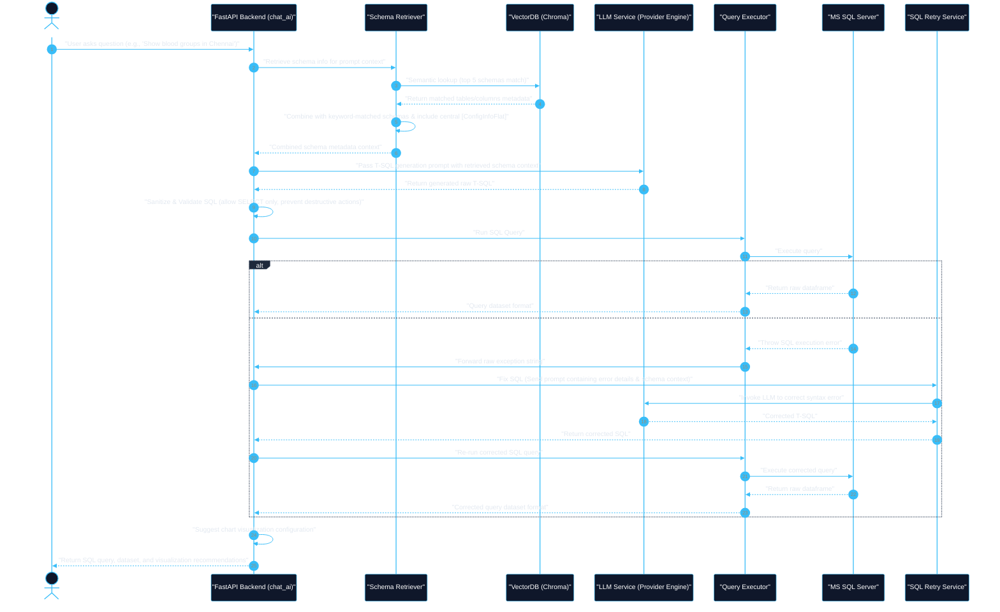

# ContextualSQL: AI-Powered Text-to-SQL RAG Agent for Microsoft SQL Server

ContextualSQL is a production-grade, AI-powered Text-to-SQL Retrieval-Augmented Generation (RAG) agent. It converts natural language queries into Microsoft SQL Server T-SQL, executes queries against the database, dynamically recommends and renders charts, and handles runtime failures using an automatic self-correcting validation loop.

The application features a sleek glassmorphic web interface and a robust FastAPI backend. It is designed to work with complex relational databases, featuring specialized query rules for central category tables like `Dummy_Info` mapping raw IDs to human-readable names.

---

## 🛠️ Core Technology Stack

### Backend Services
- **Framework**: FastAPI (Python 3.8+)
- **SQL Driver & ORM**: `pyodbc` & SQLAlchemy (connecting to Microsoft SQL Server)
- **Vector Database**: ChromaDB (for schema indexing and semantic lookup)
- **Model Orchestration**: Auto-fallback and key-swapping wrapper supporting Gemini, Groq, Hugging Face, local Ollama, and local Sentence-Transformers (`all-MiniLM-L6-v2`)
- **Data Manipulation**: Pandas, NumPy, OpenPyXL
- **SQL Sanitizer**: `sqlparse` (for command inspection and threat protection)

### Frontend UI
- **Structure/Layout**: HTML5 & CSS3 with custom variables (sleek dark sidebar and responsive main container)
- **CSS Framework**: Bootstrap 5 (with Bootstrap Icons)
- **Typography**: Google Fonts (Inter)
- **Data Visualization**: Recharts (dynamic chart renderer based on recommended data formats)
- **API Communication**: Native JavaScript Fetch API with automatic progress toggles

---

## 📂 Project Architecture and Structure

```
text-to-sql-ai-agent-main/
│
├── index.html                 # Single Page Application frontend UI
├── package.json               # Frontend dependencies (optional packages)
├── requirements.txt           # Python backend dependencies
├── .gitignore                 # Exclusion configuration for git tracking
├── git_commands.txt           # Setup and git commands tracker file
│
└── backend/
    ├── config.json            # Active provider settings cache
    ├── list_models.py         # Utility script to inspect supported models
    ├── test_gemini_models.py  # Diagnostic helper for Gemini API
    │
    └── app/
        ├── __init__.py
        ├── config.py          # Environment paths & Directory creation logic
        ├── main.py            # FastAPI Application startup and Router bindings
        │
        ├── models/            # Pydantic schemas and database entity representations
        │   └── session_model.py # Session request schemas
        │
        ├── routes/            # REST API Endpoint Controllers
        │   ├── chat.py        # Static chat message persistence endpoints
        │   ├── chat_ai.py     # Main AI RAG pipeline orchestrator
        │   ├── database_tree.py# Exposes active database tables/columns to the sidebar
        │   ├── export.py      # Exports query output to .xlsx or .csv
        │   ├── schema.py      # Schema retrieval endpoints
        │   ├── session.py     # Active session management API
        │   ├── settings.py    # Gets/sets provider credentials and model choices
        │   └── upload.py      # Ingests CSV/Excel/SQL and syncs Chroma vector stores
        │
        └── services/          # Business Logic and Service Layers
            ├── chart_service.py           # Suggests visual representation types
            ├── chat_history_service.py    # JSON-based chat logging utilities
            ├── conversation_memory.py     # Context window retrieval helper
            ├── database_manager.py        # SQLAlchemy SQL Server connection engine registry
            ├── database_tree_service.py   # Database reflection & table stats generator (SQL Server)
            ├── file_manager.py            # Secure file uploading & saving service
            ├── free_embeddings.py         # Multi-provider Embedding class with session caching
            ├── llm_service.py             # Multi-provider LLM invoke interface with failover
            ├── query_executor.py          # Executes SQL queries safely and returns results
            ├── schema_embedding_service.py# Vector database builder supporting offsets and backups
            ├── schema_retriever.py        # Hybrid schema matcher (Keyword + Chroma Vector Search)
            ├── schema_service.py          # Database column mapping reflection (SQL Server)
            ├── session_manager.py         # UUID folder creation and metadata management
            ├── settings_service.py        # Stores configuration settings to config.json
            ├── sql_generator.py           # Constructs custom prompts for SQL query generation
            ├── sql_retry_service.py       # Rewrites broken SQL using execution errors
            └── sql_validator.py           # Validates queries (SELECTs only; blocks drops/updates)
```

---

## ⚙️ Detailed System Flow & RAG Pipeline



---

## 🧠 Embedding Provider Auto-Selection & Session Caching

The system provides flexible vector embedding generations handled through `FreeEmbeddings` (which integrates with LangChain's `Embeddings` class). 

When the configuration `embedding_provider` is set to `"auto"`, the system selects and configures the active model automatically based on available API keys:
1. **Gemini API Key Available**: Uses `models/gemini-embedding-001`.
2. **Hugging Face API Key Available**: Uses the Inference API (`sentence-transformers/all-MiniLM-L6-v2`).
3. **Local Fallback (Default)**: Falls back to the CPU-based local LangChain `HuggingFaceEmbeddings` pipeline using `all-MiniLM-L6-v2`.

### 🛡️ active_embedding_provider.txt Cache
To avoid Chroma vector dimension mismatch exceptions (which occur when different model configurations with different vector dimensions are mixed within the same session collection), the system caches the successfully resolved embedding provider name to `sessions/{session_id}/active_embedding_provider.txt`.
- Subsequence indexing or search runs within that session **lock onto** that saved provider to maintain consistent dimensions.
- If a Chroma DB dimension mismatch error is still caught during similarity search, the retriever automatically deletes the vector collection and calls `SchemaEmbeddingService.build_vector_store` to auto-rebuild the index.

---

## ⏳ Ingestion, Key-Swapping, and Backups

- **Offset-based Syncing**: Reflections of database schemas can contain hundreds of tables. To adapt to rate limits (specifically Gemini Free Tier's 15 RPM limit), schema syncing is executed in slices/offsets of `50` tables at a time.
- **Dynamic Key-Swapping**: If the backend encounters a `429 Rate Limit Exceeded` error, it pauses indexing and passes a status flag to the UI. The user can inputs an alternative key in the modal, which is passed in the `X-Gemini-Key` header to resume progress. Alternatively, the user can click "Use Local Fallback" to wipe the vector database and rebuild using local embeddings.
- **Auto-Backup**: When starting a fresh DB sync from offset 0, the active vector index is automatically backed up as `vectordb_backup` in the session folder to enable rollback in case of indexing failures.

---

## 🛠️ Security and Sanitization Controls
To prevent SQL injection or deletion of tables on server databases:
1. **SELECT Statement Enforcer**: Any query must start with a `SELECT` statement or a `WITH` statement (allowing Common Table Expressions). Other query actions will trigger immediate failure.
2. **Forbidden Operations Parser**: The engine searches queries for keywords (`INSERT`, `UPDATE`, `DELETE`, `DROP`, `ALTER`, `CREATE`, `TRUNCATE`) using word boundary regular expressions and blocks execution if any are present.
3. **API Key Masking**: Front-facing APIs dynamically mask all stored secrets (`********`), checking them in only on save.

---

## 🚀 Setup and Configuration

### 1. Environment Configuration
Create a `.env` file in the root folder or the `backend/` directory:
```env
# Database Settings
DB_SERVER=MLS-AI-PC
DB_DATABASE=Mediscan_ObOnly
DB_DRIVER=ODBC Driver 17 for SQL Server
DB_TRUST_CERTIFICATE=yes

# LLM & Embeddings API Keys (Configure any/all fallback providers)
GEMINI_API_KEY=your_gemini_api_key_here
GROQ_API_KEY=your_groq_api_key_here
HF_API_KEY=your_huggingface_api_token_here
OLLAMA_BASE_URL=http://localhost:11434
```

### 2. Backend Installation & Server Launch
1. Open a terminal and navigate to the backend directory:
   ```bash
   cd backend
   ```
2. Set up and activate a virtual environment:
   ```bash
   python -m venv venv
   # Activate:
   # Windows (cmd):
   venv\Scripts\activate
   # Windows (Powershell):
   .\venv\Scripts\Activate.ps1
   # macOS/Linux:
   source venv/bin/activate
   ```
3. Install required Python packages:
   ```bash
   pip install -r requirements.txt
   ```
4. Run the FastAPI development server:
   ```bash
   uvicorn app.main:app --reload --host 0.0.0.0 --port 8000
   ```

### 3. Frontend Running Instructions
1. Open the project root.
2. Open `index.html` directly in a browser (or host it locally via a developer tool like VS Code Live Server).
3. If running a static server, you can boot it via python:
   ```bash
   python -m http.server 3000
   ```
4. Access the user interface at `http://localhost:3000`.

---

## 💡 Important Rules for Database Schema Contexts
The SQL Generator enforces specific domain mappings during SQL generation:
- **Central Lookup Registry**: The table `Dummy_Info' acts as the central source of truth for categories (marital status, salutation, blood group, states, cities, etc.).
- **ID Resolution**: Raw foreign-key IDs  are automatically mapped via `LEFT JOIN` on `Dummy_Info` to fetch the human-readable text columns instead of raw IDs.
- **Identifier Quotes**: Generates T-SQL standard identifiers wrapped in square brackets (e.g., `[Table]`).
